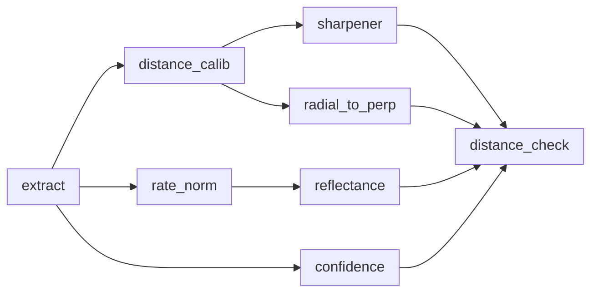

# vl53l9-transform-c

Postprocessing pipeline C library for VL53L9 sensor.

## Dependencies

This library implements the `transform-c` class which inherits from the `media-c` one. Both are part of the `media-object` project and thus are needed to build this component.

The `vl53l9-utils` library is required as well for internal operations.

## Pipeline Architecture

Data coming from the sensor are first parsed in order to extract metadata and separate the depth, amplitude and ambient raw images.

The pipeline architecture allows to bypass some components that might not be required by your application to reduce the execution time through dedicated controls (i.e. `bypass-r2p-algo`).

Filtering is done at the end of the pipe, through the `distance_check` block, depending on the information provided by each algorithm and the associated pixel-validity filters. The configuration of the filters is exposed to the user through dedicated controls (i.e. `bypass-r2p-filter`).

The supported streams are:

| Name       | Direction | Pixel Format       |  Resolution                  |
|------------|-----------|--------------------|------------------------------|
| raw        | input     | 3DMD               | [(100, 149), (14842, 1)]     |
| depth      | output    | [ZF32, ZAPC]       | [(54, 42), (24, 20)]         |
| ambient    | output    | IF32               | [(54, 42), (24, 20)]         |
| amplitude  | output    | AF32               | [(54, 42), (24, 20)]         |
| confidence | output    | CF32               | [(54, 42), (24, 20)]         |

The following block diagram shows the data path to process the `depth` stream:



## Getting Started

### Initialization

To be able to use the `vl53l9-transform-c` you must first of all allocate a handle through the `vl53l9_transform_create()` method.

Then the software needs to call the `initialize` method of the table which will take care of creating and setup a dedicated context for the provided instance. This will be stored in the `private_data` field of the handle.

```c
transform_t *p_transform = vl53l9_transform_create();
transform_initialize(p_transform);
```

Ressources associated with a given instance can be freed calling the `release` method. Then the handle can be deallocated calling the destructor.

```c
transform_release(p_transform);
vl53l9_transform_destroy(p_transform);
```

### Configuration

It is possible to programmatically inspect the list of supported streams and controls with the following lines:

```c
const streams_t *stream_list;
transform_get_streams(p_transform, &stream_list);
streams_inspect(stream_list, printf);

const controls_t *control_list;
transform_get_controls(p_transform, &control_list);
controls_inspect(control_list, printf);
```

#### Controls

Set mandatory controls related to calibration data:

```c
transform_set_control(p_transform, "calib-buffer", (value_t){ .val.v_ptr = calib_data, .tid = VTID_POINTER })
```

Controls are taken into account when calling the `prepare` method:

```c
transform_prepare(p_transform);
```

#### Capabilities

At least one input and output stream must be configured, this is a mandatory step since no default value is provided by the implementation. The desired configuration must be explicitly set. Additionnally, input streams must be configured before output ones.

For instance, to define raw input stream properties (pixel format and resolution should match one of the capabilities supported by the stream):

```c
property_t raw_format = { "format", { .val.v_string = "3DMD", .tid = VTID_STRING } };
property_t raw_width = { "width", { .val.v_uint32 = in_width, .tid = VTID_UINT32 } };
property_t raw_height = { "height", { .val.v_uint32 = in_height, .tid = VTID_UINT32 } };

properties_t *raw_props = properties_new(3); // format, width, height
properties_add(raw_props, &raw_format);
properties_add(raw_props, &raw_width);
properties_add(raw_props, &raw_height);
capabilities_t *raw_caps = capabilities_new_simple(&raw_props);

properties_free(raw_props, NULL);
```

```c
transform_set_stream_capabilities(p_transform, "raw", raw_caps);
```

When setting capabilities for an output stream, the library checks the consistency of the resolution based on the input.

### Processing

Data exchanges between the application side and the postprocessing library happen through `stream_buffers_t` objects. They contain an entry for each `stream_buffer_t` associated with a given stream. Each `stream_buffer_t` comes with a memory pool (`memories_t`) that must be previously allocated for each buffer (`memory_t`). This operation can be done either with static or dynamic allocation.

Refer to the example code to see how to allocate memory and properly initialize the structure.

For instance, the following lines allow to provide the raw input data and request depth output:

```c
stream_buffers_t *stream_buffers = stream_buffers_new(2);
stream_buffers_add(stream_buffers, &in_raw_stream_buffer);
stream_buffers_add(stream_buffers, &out_depth_stream_buffer);
```

Calling the `process_stream` method triggers the computation of the requested streams.
The first call might take more time to be executed due to the computation of calibration maps.

```c
while (1) {
    // retrieve raw data from the sensor

    transform_process_stream(p_transform, stream_buffers);

    // application logic
}
```
